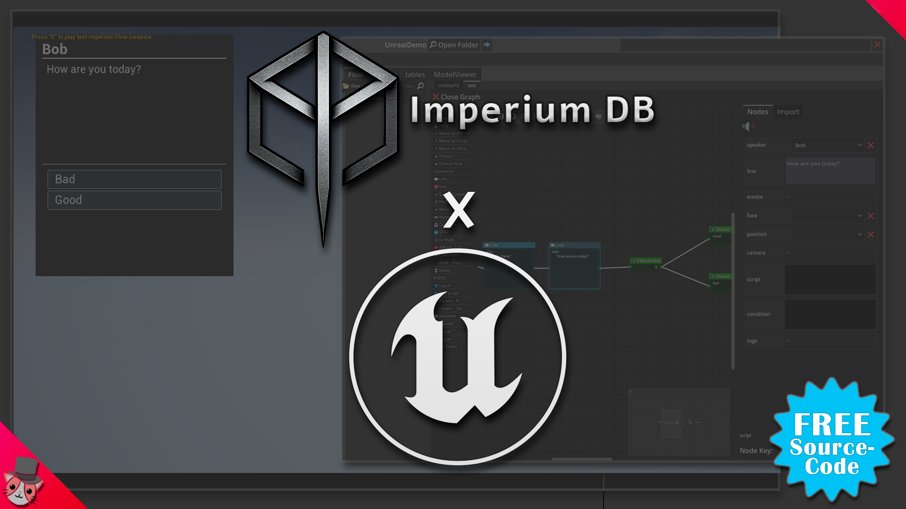
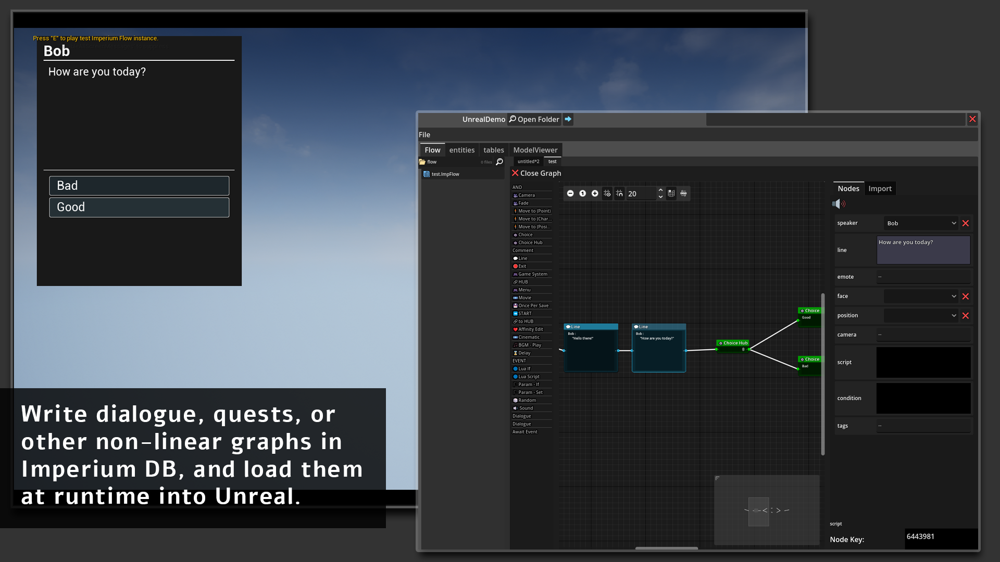
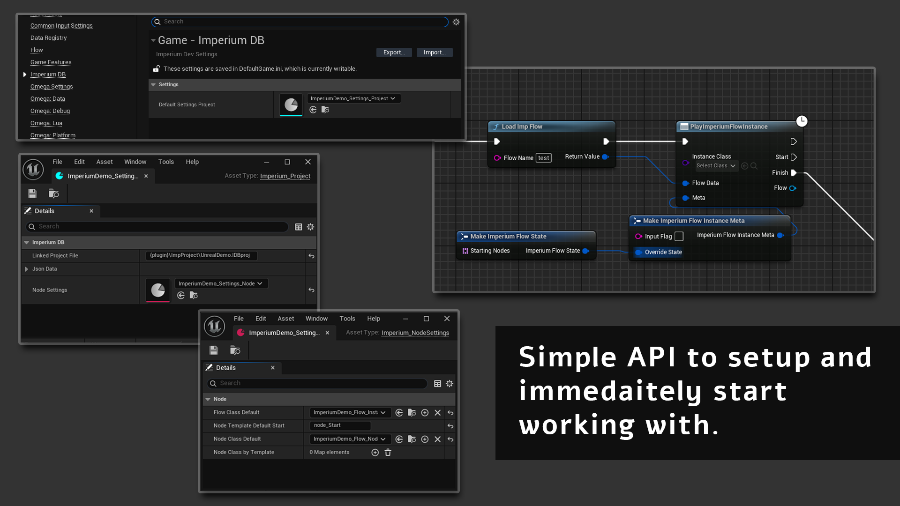

A plugin for Unreal Engine 5 that allows the use of loading and playing `.ImpFlow` assets created in ImperiumDB at runtime.

* [ImperiumDB](https://github.com/StudioSyndiCatCaius/ImperiumDB)
* FAB marketplace version (coming soon)

